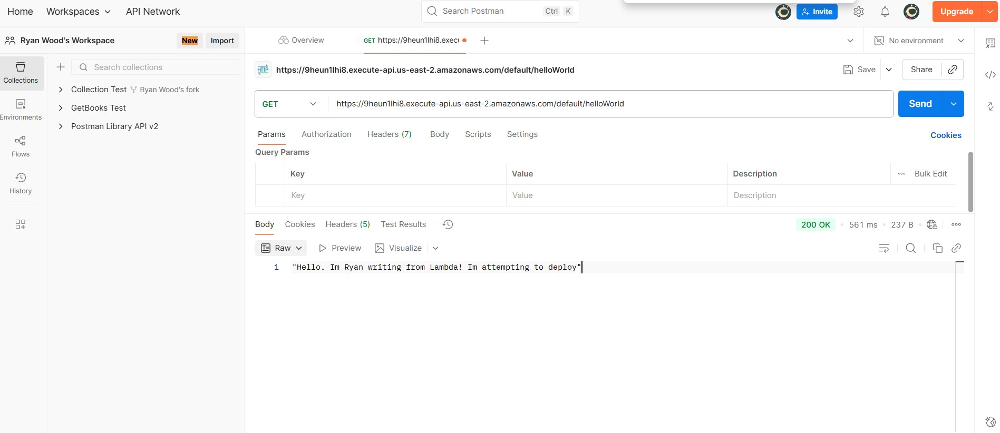

I am finishing the html-css-js portfolio task on Altcademy. 
# AWS Lambda HelloWorld API

This project is a simple serverless API built with AWS Lambda and exposed publicly with Amazon API Gateway. I tested it using Postman to confirm it returns the expected response.

## Live Endpoint
[Live Endpoint](https://9heun1lhi8.execute-api.us-east-2.amazonaws.com/default/helloWorld)


## Postman verification

Expected response body:
```text
Hello. I'm Ryan writing from Lambda! I'm attempting to deploy.
